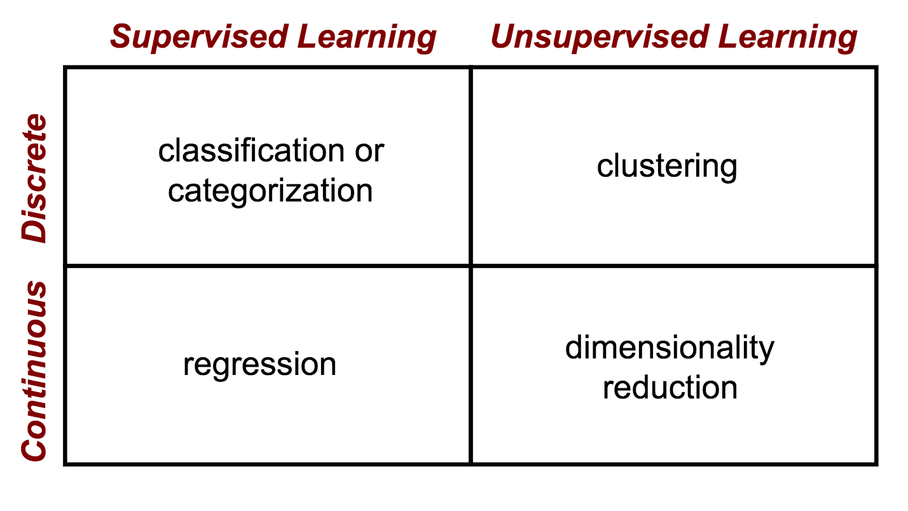

<!-- $theme: default -->

Fundamentos em Data Science
============================

Fábio Sato

:envelope: fabiosato@gmail.com

---
# Treinamento

- Aulas terças e quintas, entre 19h e 22h
- A princípio teremos 8 aulas. Previsão de conclusão do curso no dia 14/12.
- Cada aula terá sessões teóricas e práticas
- Objetivos:
	- Formatar um treinamento de fundamentos em Data Science
	- Promover o networking entre profissionais interessados na área

---
# Conteúdo do Treinamento

- Introdução a Data Science e Aprendizado de Máquina
- Python, Jupyter, Scikit-Learn e Keras
- Manipulação e análise de dados com Pandas, Matplotlib e Seaborn
- Aprendizado supervisionado e não-supervisionado, e aprendizado por reforço
- Bases de treinamento, testes, métricas, validação cruzada
- Normalização de dados, preenchimento de falhas, *feature engineering*
- Algoritmos de clustering: K-Means e K-NN
- Support Vector Machines
- Bagging, boosting e Ensembles
- Árvores de Decisão, Random Forests e Gradient Boosting
- Redes Neurais

---
# Dia 1 - Agenda

## Introdução a ML e Python

* **Conceitos Teóricos**:
	* Data Science
	* Machine Learning: 
* **Parte Prática**:
	* Introdução ao Python

---
# Sobre mim 

- **Formação**:
	- UFPR: Engenheiro Civil
	- PUC-PR: Especialista em Tecnologia da Informação
	- UFPR: Mestrado em Ciência da Computação
- **Área de atuação**:
	- SIMEPAR: Computação Científica desde 1998
- **Temas de trabalho/pesquisa**:
	- Processamento simbólico, bases de dados, computação distribuída, programação funcional, aprendizado de máquina, visualização científica, computação evolucionária, sistemas de informação geográficos, sensoriamento remoto, telemetria

---
# Fale um pouco sobre você :smile:
 - Formação acadêmica/tecnológica
 - Experiência profissional
 - Áreas de interesse
 - Expectativa com o treinamento

---
# O que é *Data Science*?

É a aplicação da metodologia científica para a exploração, análise, visualização, e aprendizado a partir de dados.

---
# Metodologia Científica

A metodologia científica é um conjunto de técnicas para investigar um fenômeno para adquirir novos conhecimentos ou corrigir/atualizar um conhecimento anterior.

---
# Metodologia Científica

---
# Data Science - Ferramentas

- :books: **Matemática**: álgebra linear, sistemas não-lineares, cálculo, otimização, pesquisa operacional, etc.
- :clipboard: **Estatística**: distribuições, inferência, teste de hipóteses, etc.
- :floppy_disk: **Programação** de Computadores
- :bar_chart: **Visualização** de Dados
- :robot: **Inteligência Artificial**: lógica formal, heurísticas e meta-heurísticas, raciocínio baseado em casos, lógica nebulosa, *aprendizado de máquina*, etc.
- :computer: **Tecnologia** (Big Data, GPUs, TPUs, etc)
-  :stuck_out_tongue_winking_eye: **Criatividade**

---
# IA -> Machine Learning -> Deep Learning
- AI - Inteligência Artificial: Área de estudo. Início na década de 50
- ML - Machine Learning: sub-área de Inteligência Artificial
- DL - Deep Learning: sub-área de Aprendizado de Máquina

---
# IA -> Machine Learning -> Deep Learning

---
# Aprendizado de Máquina (ML): Definição

> "Campo de estudo que dá aos computadores a habilidade de aprender sem serem explicitamente programados"
> -- <cite>Arthur Samuel, 1950 - 1990</cite>

---
# ML: Aprendendo a Partir de Dados

Algoritmos criados automaticamente através de dados e que podem aprender com seus erros e fazer previsões sobre novos dados.

Obtenção de um modelo a partir de amostras de dados a fim de fazer previsões ou decisões guiadas pelos dados ao invés de uma lógica programada. 

---
# Categorias de Aprendizado

Três categorias principais de aprendizado:

- Supervisionado (*Supervised Learning*)
	- Classificação
	- Regressão
- Não-Supervisionado (*Unsupervised Learning*)
	- Clustering
	- Redução de dimensionalidade
- Por Reforço (*Reinforcement Learning*)

---
# Categorias de Aprendizado

---
# Problemas de Aprendizado de Máquina

---
# Classificação *vs* Regressão

---
# Aprendizado Supervisionado

- No aprendizado supervisionado o algoritmo aprende a reconhecer padrões a partir de dados de treinamento **rotulados** (*labels*)

- De forma geral dados rotulados são dados que sofreram uma classificação/categorização manual por uma pessoa. Ex: o conteúdo de uma imagem

- O objetivo de um algoritmo supervisionado é realizar generalizações sobre novos dados de entrada baseados em dados que seguem um padrão similar

- Exemplo: treinar um filtro de spam para encontrar emails que contenham textos similares a emails que foram marcados (rotulados) como spam

---
# Aprendizado Não-supervisionado

- Enquanto o aprendizado supervisionado pode tomar um tempo considerável e (geralmente) requer uma pessoa rotulando-os, o aprendizado não-supervisionado tem por objetivo encontrar pontos de dados similares em um conjunto, de forma a identificar estruturas nos dados

- Um exemplo de aprendizado não-supervisionado é o agrupamento (*clustering*) de usuários baseados em seus hábitos de consumo para customização de campanhas de publicidade

---
# Aprendizado por Reforço

- É similar ao aprendizado supervisionado com a diferença de que objetivo é treinar um agente em um determinado ambiente

- Pode-se treinar o agente para realizar certas ações tentando maximizar uma pontuação imaginária. Quanto maiores os pontos, as ações mais ações corretas foram realizadas. A diferença entre o aprendizado por reforço e o aprendizado supervisionado é que o algoritmo precisa realizar uma série de ações antes de saber o quão bem ele desempenhou

- Um exemplo de uma aplicação web é modificar os produtos automaticamente de forma a maximizar as taxas de conversão de compras 

---
# Supervisionado x Não-Supervisionado

---
# Aprendizado Supervisionado - Workflow

---
# Aprendizado Supervisionado - Exemplo
Classificação automática de peixes: salmão vs robalo

---
# Classificação - Exemplo: Salmão x Robalo

- Configurar uma câmera para observar peixes em uma esteira
- Classificar cada peixe como salmão ou robalo
- Preferir errar robalos ao salmões

---
# Classificação - Exemplo: Workflow

---
# Exemplo: Espaço **IDEAL** de Características

- As populações de salmões e robalos são claramente distintas

- Cada dimensão é definida por uma propriedade do peixe, a maioria da qual não pode ser medida com  uma câmera

---
# Exemplo: Espaço **REAL** de Características

- Projeção de um espaço de alta dimensionalidade para um espaço de menor dimensão

---
# Exemplo: Características -> Distribuição de Probabilidades

- Podemos analisar cada característica individual como uma distribuição de probabilidades sobre o espaço

- Ou seja, uma projeção para um espaço unidimensional

---
# Exemplo: Seleção de Características

- Um expert no assunto diz que o comprimento do peixe é a melhor característica (*feature*) para distinguir os peixes entre salmão e robalo
- Nós obtemos alguns exemplos de peixes e medimos o comprimento deles
	- Conjunto de treinamento (*training set*)
	- São amostras representativas da população
	- Analisamos a distribuição de probabilidadess da característica comprimento

---
# Comprimento como característica para classificação de peixes

- É possível discernir facilmente entre salmão e robalo com esta característica?

- É preciso escolher uma fronteira de decisão (*decision boundary*)
	- Minimização da perda esperada (*expected loss*)

---
# Leveza como característica para classificação dos peixes

- E se tentarmos outra característica (leveza/peso)?

---
# Combinação de Características

- Na prática raramente uma característica será suficiente
- Neste exemplo, a leveza ($x_1$) e o comprimento ($x_2$) em conjunto funcionarão melhor 

- Este é um exemplo de um espaço de características 2D:

$$x = \begin{bmatrix} x_1 \\ x_2\end{bmatrix}$$

---
# Maldição da Dimensionalidade

- As duas características combinadas obviamente separam as classes muito melhor do que isoladas
- Isto sugere adicionar mais características
- Em problemas práticos podemos ter milhares/milhões de características
- Questões principais:
	- Quantas características são necessárias?
	- Existe um ponto onde podemos ter características demais?
	- Como podemos saber de antemão quais características funcionam melhor?
	- O que acontece quando existe características redundantes ou correlacionadas?

---
# Fronteira de Decisão

## Viés (Bias) *x* Variância (Variance)

Dependendo nas características disponíveis, complexidade do problema, e classificador, as fronteiras de decisão também irão variar em complexidade

---
# Fronteira de Decisão - Variância

Fronteiras simples (linear) parecem errar algumas **tendências** (**variância**) óbvias nos dados 

---
# Fronteira de Decisão - Viés

Fronteiras complexas ficam **presas a especificidades da base de treinamento (viés)**

---
# Fronteira de Decisão - Generalização

Um problema central em reconhecimento de padrões consiste na construção de classificadores que **funcionem adequadamente em dados novos (generalização)**.

É possível predizer o quão bem nosso classificador irá generalizar em dados novos?

---
# Generalização

---
# Teoria de Decisão

- Em muitas situações, as consequências de nossas classificações não possuem impacto/custo iguais
- No caso do nosso exemplo, é aceitável vender pedaços de salmão como robalo. Entretanto, o contrário não é verdadeiro
- Desta forma, é necessário ajustar nossas decisões (fronteira) para incorporar estes custos de erros de decisões
- Nosso objetivo é definir uma fronteira de decisão que minimize o custo geral

--- 
# Desenvolvimento de um classificador supervisionado

1 - Escolha as características: *pode ser o passo mais importante*!
2 - Obtenha dados de treinamento
3 - Escolha o algoritmo (forma/complexidade da fronteira de decisão)
4 - Obtenha um modelo a partir dos dados de treinamento e do algoritmo escolhido
5 - Use o modelo para classificar novos exemplos

---
# Discussão: Você imagina como seria o funcionamento de um algoritmo não-supervisionado de classificação de peixes?

