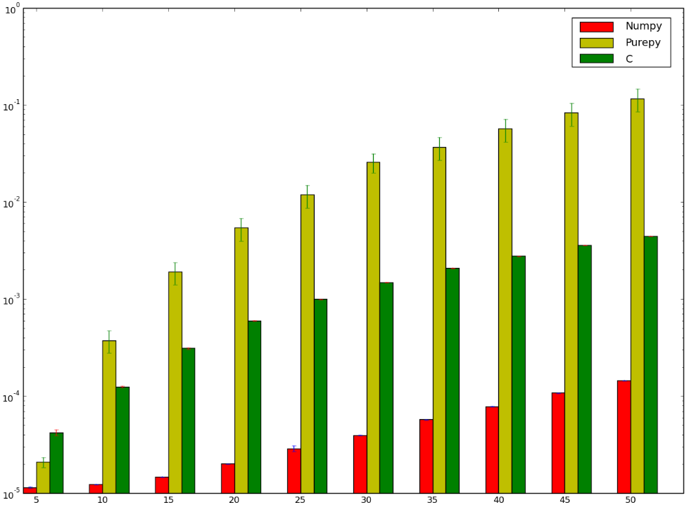
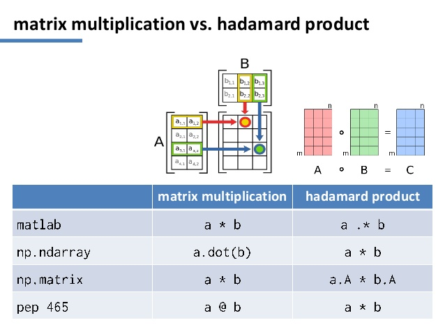

Fundamentos em Data Science
============================

## Introdução ao Python - Tópicos Avançados

Fábio Sato
fabiosato@gmail.com

---
# Ordenação

Listas possuem um método `sort` que permite ordená-las

Caso seja necessário manter o valor original da lista, uma nova lista ordenada pode ser criada com a função `sorted`

```python
x = [4, 1, 2, 3]
y = sorted(x) # y = [1, 2, 3, 4], x não é modificado
x.sort() # x = [1, 2, 3, 4]
```

Para ordenar do maior para o menor, deve-se especificar o parâmetro `reverse=True` e a função `abs` para comparação dos valores

```python
x = sorted([-4, 1, -2, -3], key=abs, reverse=True)
```

---
# List Comprehensions

Frequentemente é necessário transformar uma lista em outra, selecionando apenas alguns elementos.

Um jeito "Pythônico" de realizar esta operação é através de *list comprehensions*

```python
even_numbers = [x for x in range(5) if x % 2 == 0] # [0, 2, 4]
squares = [x * x for x in range(5)] # [0, 1, 4, 9, 16]
even_squares = [x * x for x in even_numbers] # [0, 4, 16]
```

---
# List Comprehensions

De forma similar listas podem ser transformadas em dicionários ou conjuntos

```python
square_dict = { x: x * x for x in range(5) }
square_set = { x * x for x in [1, -1] }
```

---
# List Comprehensions

Uma *list comprehension* pode utilizar múltiplos `for`:

```python
increasing_pairs = [(x, y)
         for x in range(10)
         for y in range(x + 1, 10)]
```

---
# Formatação de Strings

Posicional
```python
'{0}, {1}, {2}'.format('a', 'b', 'c')

'{2}, {1}, {0}'.format('a', 'b', 'c')
```

C-Style

```python
import math

'%d %.8f %s' % (10, math.pi, 'Hello')
```
---
# Arquivos

A função `open`é utilizada para abrir/criar um arquivo

```python
file = open('leitura.txt', 'r')
```

Modos de abertura do arquivo

- `r`: leitura
- `w`: escrita
- `x`: criação e escrita em um novo arquivo
- `a`: abre o arquivo para concatenação
- `r+`: utiliza o arquivo tanto para leitura quanto escrita

Para fechá-lo basta chamar o método `close`

```python
file.close()
```


---
# Leitura de Arquivos


Leitura do conteúdo completo como uma string
```python
file.read()
```

Leitura da próxima linha (lê até encontrar um caracter de nova linha)
```python
file.readline()
```

Leitura de todas as linhas do arquivo retornando uma lista de strings
```python
file.readlines()
```

---
# Escrita de Arquivos

Cria um novo arquivo para escrita (irá destruir o conteúdo anterior caso o arquivo já exista)
```python
file2 = open('escrita.txt', 'w')
```

O método write recebe uma string

```python
file2.write('teste')
```

---
# Serialização de Objetos

O módulo `pickle`do Python implementa protocolos binários para serialização e deserialização de objetos.


- *Pickling* é o processo onde uma hierarquia de objetos é convertido em um fluxo de bytes.

- *Unpickling* é a operação inversa

---
# NumPy

Biblioteca para cálculos numéricos

---
# Serialização de Objetos - Exemplo

Escrita
```python
import pickle

favorite_color = {"lion": "yellow", "kitty": "red"}
pickle.dump(favorite_color, open("save.p", "wb"))
```

Leitura

```python
import pickle

favorite_color = pickle.load( open("save.p", "rb") )
```

---


- Alto desempenho para cálculos vetoriais e matriciais
- Funções pré-compiladas para rotinas numéricas
- Escrito em C e Fortran
- Cálculo vetorizado
	- operações são realizadas ao mesmo tempo em um conjunto inteiro de valores
	- *Single Instruction, Multiple Data (SIMD)*

---
# NumPy - Arrays

Matrizes em Numpy são representadas pelo tipo `ndarray` 

Utilizada praticamente em todas as bibliotecas/frameworks de cálculo científico em Python


---
# NumPy - Exemplo

Implementação "ingênua" de adição de duas matrizes

```python
def array_sum():
    X = range(1000000)
    Y = range(1000000)
    Z = []
    for i in range(len(X)):
        Z.append(X[i] + Y[i])
```

Verifique o tempo de execução

```python
%timeit array_sum()
```
---
# NumPy - Exemplo

Implementação em NumPy

```python
from numpy import *

def array_sum_numpy():
    X = arange(1000000)
    Y = arange(1000000)
    Z = X + Y
```

Verifique o tempo de execução da nova implementação e calcule o ganho de desempenho

```python
%timeit array_sum()
```

---
# NumPy - Desempenho

Numpy permite escrever códigos mais concisos e eficientes



https://stackoverflow.com/questions/10442365/why-is-matrix-multiplication-faster-with-numpy-than-with-ctypes-in-python

---
# NumPy - Arrays

```python
from numpy import *

v = array([1, 2, 3, 4])
M = array([[1, 2], [3, 4]])

type(v)
type(M)

v.size
M.size

v.shape
M.shape

v.dtype
M.dtype

M2 = array([[1., 2.], [3., 4.]])
M2.dtype
```

---
# NumPy - arange e linspace

```python
# Argumentos: início, fim e passo
arange(0, 10, 1)

# Argumentos: início, fim e número de valores/pontos e
linspace(0, 9, 10)
```

---
# NumPy - Matriz Diagonal e Nula

Para criar uma matriz diagonal
```python
diag([1, 2, 3])
```

Para criar uma matriz nula (todos elementos iguais a zero)
```python
zeros((3,3))
```

---
# NumPy - Acesso a elementos de uma matriz

```python
M = random.rand(3, 3)

M

M[1, 1]

# Qual o resultado destes fatiamentos?
M[1, :]
M[:, 1]
M[1:3]
M[:,0:1]
```

---
# NumPy - Atribuição de valores

```python
M[1,:] = 0

M
```

---
# NumPy - Índices Negativos

```python
M[-2]

M[-1]
```

---
# NumPy - Escalares
Operações com escalares são aplicadas a todos elementos da matriz

```python
M * 2

M + 2
```
---
# Numpy - Multiplicação de Matrizes




---
# NumPy - Multiplicação

Elemento a elemento (Hadamard)
```python
M * M
```

Produto Matricial

```python
dot(M, M)
```

---


---
# Matplotlib


- Biblioteca para geração de gráficos 2D e 3D
- Permite o ajuste fino sobre todos os detalhes dos gráficos
- Vários formatos de saída suportados: PNG, PDF, SVG, EPS
- Pyplot: módulo para plotagem de *charts*


---
# Matplotlib - Configuração

- As configurações padrões podem ser sobrescritas no arquivo `matplotlibrc`
- No Linux, o arquivo geralmente fica localizado em `~/.config/matplotlib/matplotlibrc`
- Em outros sistemas operacionais em ~/.matplotlib/matplotlibrc
- `matplotlib.matplotlib_fname()` retorna o caminho do arquivo de configuração que está sendo utilizado
- Opções de customização estão documentadas em http://matplotlib.org/users/customizing.html

---
### Pyplot - Exemplo

```python
import matplotlib.pyplot as plt
import numpy as np

x = np.linspace(0, 3,*np.pi, 500)

plt.plot(x, np.sin(x**2))

plt.title("Pyplot Example")

plt.savefig("teste.png")

plt.show()
```

---
# Pandas


- **Pan**el **Da**ta **S**ystem
- Ferramenta para manipulação e análise de dados
- Similar ao R, Matlab, SAS
- Um "MS Excel" para programadores :smile:
- Instalação: `pip install pandas`

---
# Pandas - Estruturas de Dados: Series

- Array unidimensional (vetor) contendo dados e rótulos (ou índices)
- Diversas maneiras de construir séries

```python
import pandas as pd

s = pd.Series(list('abcdef'))
s

t = pd.Series([2, 4, 6, 8])
t
```

---
# Pandas - Series: Trabalhando com Índices

- Um índice pode ser especificado para uma série
- Elementos individuais da série podem ser acessados pelo índice
- Múltiplos elementos podem ser selecionados com índices múltiplos

```python
s = pd.Series([2, 4, 6, 8], index = ['f', 'a', 'c', 'e'])

s['a']

s[['a', 'c']]
```

---
# Pandas - Series: Índices

- Séries são dicionários ordenados com comprimento fixo
- Entretanto, ao contrário de dicionários, items do índice não precisam ser únicos

```python
s2 = pd.Series(range(4), index= list('abab'))
s2

s['a']

s2['a']
```

---
# Pandas - Series: Operações

- Filtros
- Operações "matriciais" como NumPy
- Retornam uma nova série

```python
s[s > 4]

s>4

s*2
```

---
# Pandas - Dados Ausentes

Pandas pode tratar dados ausentes

```python
sdata = {'b': 100, 'c': 150, 'd': 200}

s = pd.Series(sdata)
s

s = pd.Series(sdata, list('abcd'))
s
```

---
# Pandas - DataFrame
- Estrutura similar a uma planilha eletrônica contendo uma coleção de colunas ordenadas
- Índices para linhas e colunas
- Similar a um dicionário de Series (com índice compartilhado)

---
# Pandas - DataFrame

Criação com um dicionário com listas com comprimento igual

```python
data = {'state': ['FL', 'FL', 'GA', 'GA', 'GA'],
        'year': [2010, 2011, 2008, 2010, 2011],
        'pop': [18.8, 19.1, 9.7, 9.7, 9.8]}

frame = pd.DataFrame(data)
frame
```
---
# Pandas - DataFrame

Criação com um dicionário de dicionários

```python
pop_data = {'FL': {2010: 18.8, 2011: 19.1},
            'GA': {2008: 9.7, 2010: 9.7, 2011: 9.8}}

pop = pd.DataFrame(pop_data)
pop
```

---
# Pandas - DataFrame

- Columas podem ser recuperadas como Series
	- Syntaxe de dicionário
	- Syntaxe de atributo 	
- Linhas podem ser recuperadas pela posição ou pelo nome (atributos `iloc` ou `loc`)

```python
frame['state']

frame.state

pop.iloc[0]

pop.loc[2010]
```

---
# Pandas - Novas Colunas

Novas colunas podem ser adicionadas
- Calculadas / Derivadas
- Atribuição direta

```python
frame['other'] = np.nan
frame

frame['calc'] = frame['pop'] * 2
frame
```

---
# Pandas - Reindexação

Criação de um novo objeto com os dados de acordo com um novo índice

```python
obj = pd.Series(['blue', 'purple', 'red'], index=[0, 2, 4])
obj

obj.reindex(range(4))

obj.reindex(range(5), fill_value='black')

obj.reindex(range(5), method='ffill')

obj.reindex(range(5), method='bfill')

obj.reindex(range(5), method='nearest')
```


---
# Pandas - Indexação Booleana

```python
pop < 9.8

pop[pop < 9.8] = 0
```

---
# Pandas - Carga de Dados

- Suporte a diversas formas de leitura de dados
- Dados textuais:
    - `read_csv`
    - `read_table`
- Dados estruturados
    - JSON
    - XML
    - HTML
- Excel (depende da instalação dos pacotes `xlrd` e `openpyxl`)
- Bancos de dados
    - módulo `pandas.io.sql` (`read_frame`) 

---
# Pandas - Sumarização e Estatísticas Básicas

```python
mpg = pd.read_csv('http://bit.ly/2jjoxjk')

mpg

mpg.head()

mpg.tail()

mpg.min()

mpg.max()

mpg.describe()
```

---
# Pandas - Group By

Agrupa dados por determinada coluna para operações de agregação

```python

mpg.groupby('model_year')['mpg'].max()

```

---
# Pandas - Pivot Table

Cria uma tabela de pivot similar a de uma planilha eletrônica

```python

pd.pivot_table(mpg,
               values='mpg',
               index='model_year',
               columns='cylinders',
               aggfunc=max)

```
---
# Pandas - Exercícios

1 - Adicione ao dataframe `mpg` uma nova coluna contendo a relação entre peso e potência.

2 - A partir do dataframe `mpg` apresente a relação entre os maiores e menores valores de mpg agrupados por cilindrada, para os veículos produzidos a partir de 75 e que possuem peso inferior a 3500.

