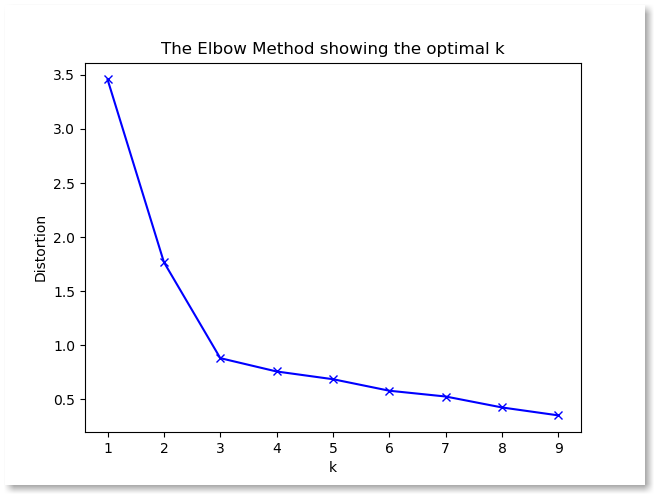

Fundamentos em Data Science
============================

## Aula 3 - Clustering

Fábio Sato
fabiosato@gmail.com

---
# Aprendizado Baseado em Instâncias (*Instance Based*)
Uma forma de classificar um exemplo é lembrar de outro similar cuja
classe é conhecida e assumir que o novo exemplo terá a mesma
classe

Essa filosofia exemplifica os sistemas baseados em exemplos, que
classificam exemplos nunca vistos através de exemplos similares
conhecidos

Esse tipo de sistema de aprendizado é denominado preguiçoso
(lazy)

---
# Aprendizado Preguiçoso (*Lazy*) x Guloso (*Eager*)
Necessitam manter todas instâncias em memória para classificar novas instâncias

Sistemas gulosos descartam os dados após gerar o modelo

Nos algoritmos preguiçosos, o ideal é reter somente as instâncias mais representativas (como saber quais?)

Clustering - algoritmos mais conhecidos:
	- $k$-Vizinhos mais Próximos ($k$-Nearest Neighbours/$k$NN)
	- $k$-Medianas ($k$-Means)

---
# Clustering

Classificação de um conjunto de observações em subconjuntos denominados agrupamentos (*clusters*)


As observações/instâncias de um mesmo agrupamento são similares em algum sentido (similaridade)

Utilizado para aprendizado não-supervisionado e análise de dados

---
# Clustering - Similaridade

Como determinar a similaridade entre duas exemplos de forma que os agrupamentos sejam formados por instâncias semelhantes?

Funções de distância são utilizadas: euclidiana, manhattan


http://scikitlearn.org/stable/modules/generated/sklearn.neighbors.DistanceMetric.html

---
# $k$-Means

Algoritmo para classificar ou agrupar instâncias baseadas nas características em $k$ grupos

$k$ é um número positivo inteiro

O agrupamento é realizado minimizando a soma dos quadrados das distâncias entre os dados centróide do *cluster* correspondente

---
# $k$-Means - Algoritmo


---
# $k$-Means - Exemplo


---
# $k$-Means - Scikit-Learn

```python

from sklearn import datasets
from sklearn.cluster import Kmeans

iris = datasets.load_iris()

X = iris.data
y = iris.target

kmeans = KMeans(n_clusters=3)
kmeans.fit(X)

y_pred = kmeans.labels_
```

---
# Avaliação de Classificação - Matriz de Confusão

Avaliação do modelo de classificação

Número de classificações corretas versus as classificações preditas para cada classe


---
# Matriz de Confusão - Scikit-Learn

```python

from sklearn.metrics import confusion_matrix

confusion_matrix(y, y_pred)

```

---
# Métricas de Classificação - Precision e Recall


---

# Métricas de Classificação - Scikit-Learn

```python

from sklearn.metrics import precision_score, recall_score

precision_score(y, y_pred, average='macro')

recall_score(y, y_pred)
```

---
# $k$-Means - Discussão

- Discuta os resultados de classificação obtidos com $k$-Means para o dados do Iris

- Suponha que você não soubesse o número de classes de antemão. Como avaliar o melhor $k$?

---
# Clustering - Análise de Silhueta
Analisa a distância de separação dos *clusters* obtidos

A plotagem de silhueta apresenta uma medida de quão perto cada ponto de um cluster está próximo de clusters vizinhos. Esta distância varia entre [-1, +1]

Coeficientes de silhueta próximos a +1 indicam que a amostra está longe dos clusters vizinhos

Valores 0 indicam que a amostra está na fronteira de decisão ou muito próxima dela

Valores negativos indicam que as amostras foram assinaladas ao cluster errado

---
# Clustering - Silhueta: Exemplo


---
# Clustering - Silhueta: Scikit-Learn

```python
from sklearn.metrics import silhouette_score

for k in range(2, 7):
    kmeans = KMeans(n_clusters=k)
    kmeans.fit(X)
    y_pred = kmeans.predict(X)
    print("k=%d, silhueta=%f" % (k, silhouette_score(X, y_pred)))
```

---
# Clustering - Cotovelo (Elbow)

Método para interpretação e validação da consistência interna dos clusters para ajudar a encontrar un $k$ ótimo

Procura pela variância explicada pelos clusters de forma que a adição de um novo cluster não traduz em um melhor modelo para os dados

Os primeiros clusters adicionam mais informação (mais variância) mas em um determinado ponto os ganhos começam a se tornar marginais

---
# Clustering - Cotovelo: Exemplo



---
# Clustering - Cotovelo: Scikit-Learn

```python
distortions = []
K = range(1,10)
for k in K:
    kmeans = KMeans(n_clusters=k).fit(X)
    kmeans.fit(X)
    distortions.append(sum(np.min(cdist(X, kmeans.cluster_centers_, 'euclidean'), axis=1)) / X.shape[0])
 
# Plot the elbow
plt.plot(K, distortions, 'bx-')
plt.xlabel('$k$')
plt.ylabel('Distorção')
plt.title('Método do Cotovelo - busca do valor ótimo de $k$')
plt.show()
```

---
# $k$-NN - Vizinhos mais Próximos

No $k$-NN uma instância é atribuída a classe mais comum utilizando instâncias similares a ela

Algoritmo de classificação supervisionada

---
# $k$-NN - Problemas

- Como medir a similaridade entre instâncias?
- Como escolher a classe mais comum?


---


---
# $k$-NN - Scikit-Learn

```python

from sklearn.neighbors import KNeighborsClassifier
from sklearn.model_selection import train_test_split

X_train, X_test, y_train, y_test = train_test_split(X, y, test_size=0.3, random_state=1234)

knn = KNeighborsClassifier(n_neighbors=3)

knn.fit(X_train, y_train)

y_pred = knn.predict(X_test)
```

---
# $k$-NN - Exercício

- Utilize o algoritmo $k$-NN na base de dados MNIST. 
- Verifique a acurácia do algoritmo para diferentes valores de $k$ comparando os resultados do algoritmo nas bases de treinamento e de testes.
- Visualize os clusters resultantes da melhor configuração de $k$