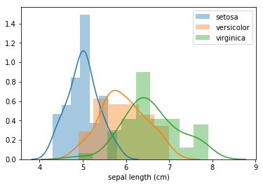
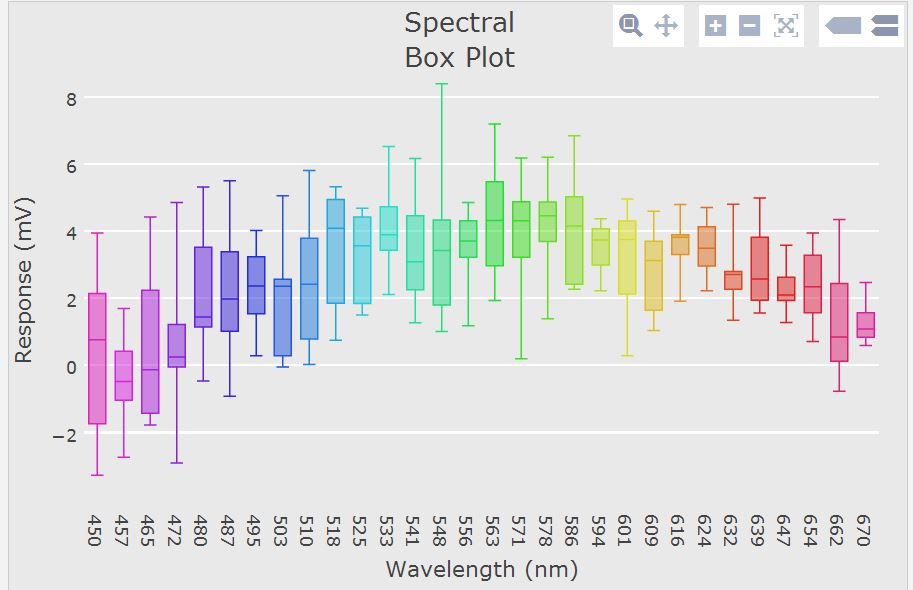
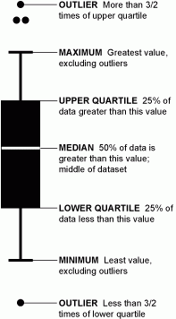
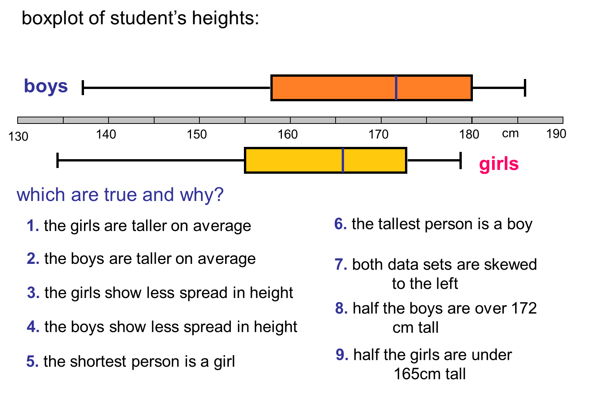

Fundamentos em Data Science
============================

## Aula 3 - Análise Exploratória de Dados

Fábio Sato
fabiosato@gmail.com

---
# Pacotes

Para esta aula iremos precisar instalar alguns pacotes adicionais

```bash
pip install sklearn
pip install scipy
pip install seaborn
```

---
# Análise Exploratória de Dados - *Exploratory Data Analysis* (EDA)

Conjunto de técnicas de visualização e tranformação para explorar dados de uma maneira sistemática


Abordagem para análise de dados que emprega uma variedade de técnicas (a maioria gráfica) para:

- gerar *insights* sobre um conjunto de dados
- revelar estrutura/padrões dos dados
- extrair variáveis importantes
- detectar *outliers* e anomalias
- testar premissas
- desenvolver modelos parcimoniosamente
- determinar fatores ótimos

---
# EDA - Processo
Não é um processo formal. *EDA is a state of mind*

Durante a fase inicial da EDA deve-se ficar a vontade para investigar qualquer idéia

Algumas dessas idéias irão simplesmente surgir e outras serão um beco sem saída

Processo geral:
- Gerar perguntas/hipóteses sobre os dados
- Busca por respostas a estas questões através da visualização, transformação e modelagem dos dados
- Utilizar o que foi aprendido para refinar questões ou gerar novas


---
# EDA - *Data Cleaning*

A EDA é uma parte importante de qualquer análise de dados, mesmo que as perguntas/respostas sejam conhecidas, porque sempre é necessário investigar a qualidade dos dados.

A limpeza de dados é apenas uma aplicação da EDA: você faz perguntas sobre se seus dados atendem às suas expectativas ou não


---
# EDA - Pensamento Crítico e Criatividade
O objetivo durante a EDA é desenvolver uma compreensão sobre os dados

O jeito mais fácil de alcançar este objetivo é através da utilização de perguntas que conduzam a investigação

Um pergunta foca a atenção do analista a um aspecto específico dos dados e auxilia na decisão de quais gráficos, modelos ou transformações realizar

---
# EDA - Perguntas/Hipóteses
É difícil formular perguntas reveladoras no início da análise por não ainda não temos *insights* sobre os dados

Por outro lado, cada nova questão gerada e respondida irá expor o analista a novos aspectos sobre os dados e aumentar a chance de realizar novas descobertas

Pod-se rapidamente encontrar informações interessantes sobre os dados se perguntas provocativas forem formuladas após a respostas das questões iniciais

---
# EDA - Variância

Não existem regradas para quais questões devem ser perguntadas para guiar a pesquisa

Entretanto, dois tipos de questões serão sempre úteis para realizar descobertas:

- Qual tipo de variação ocorre nas variáveis
- Qual tipo de covariância ocorre entre as variáveis

---
# Seaborn

Seaborn é uma biblioteca para fazer gráficos estatísticos atraentes e informativos em Python. 

É construído em cima do matplotlib e está bem integrado com a pilha PyData, incluindo o suporte para estruturas de dados numpy e pandas


---
# Seaborn - Recursos

- Temas integrados para estilizar gráficos matplotlib
- Ferramentas para escolher paletas de cores adequadas para descoberta visual de padrões em dados
- Funções para visualização e comparaçõa de distribuições univariadas e bivariadas entre subconjuntos de dados
- Ferramentas para geração e visualização de modelos de regressão lineares
- Funções para visualização e descoberta de padrões (*clustering*) de matrizes de dados
- Funções para análises de dados de séries temporais

---
# Seaborn - Distribuição

Frequentemente a primeira análise a ser realizada é a verificação da distribuição dos dados

A maneira mais conveniente para olhar rapidamente a distribuição de uma variável é através da função `distplot`. 

Esta função irá plotar um histograma e encaixar um função de estimativa de densidade de kernel (densidade de probabilidade).

---
# Iris - Dataset
Fisher - The use of multiple measurements in taxonomic problem - 1936

Esta é a base de dados mais conhecida na literatura de reconhecimento de padrões 


Este conjunto de dados contêm 3 classes com 50 instâncias cada, onde cada classe refere-se a um tipo de planta do gênero *Iris*

---
# Iris - Dados

Os dados do Iris estão disponíveis no Scikit-Learn

```python
from sklearn import datasets
import pandas as pd

iris = datasets.load_iris()

dir(iris)
```
---
# Iris - Exercício

## Crie um DataFrame Pandas a partir dos dados carregados pelo Scikit-Learn

---
# Iris - DataFrame

## Solução

```python
df = pd.DataFrame(data=iris.data, columns=iris.feature_names)

df['species_id'] = pd.Series(iris.target)

df['species_name'] = 
  pd.Series([iris.target_names[x] for x in iris.target])
```

---
# Seaborn - Distribuições

A forma mais rápida de visualizar a distribuição de valores de uma variável contínua com o Seaborn é através da função `distplot`

Esta função plota o histograma e ajusta uma função de estimativa de densidade de kernel (estimativa de densidade de probabilidade)

---
# Seaborn - `distplot`

```python
import seaborn as sns
import matplotlib.pyplot as plt

for l in iris.target_names:
  sns.distplot(df[df['species_name'] == l]['sepal length (cm)'])
  
plt.legend()
plt.show()
```




---
---
# Seaborn - `distplot`

## Visualize as demais distribuições de variáveis contínuas

- Alguma delas parece ser mais discriminante? Qual?

- Alguma das classes é mais facilmente separável?


---
# Seaborn - Distribuições Bivariadas

Frequentemente também é bastante interessante visualizar a distribuição bivariada de duas variáveis

A forma mais fácil de realizar isto no seaborn é através da função `jointplot`

---
# Seaborn - `jointplot`

```python
for l in iris.target_names:
    sns.jointplot(x='petal width (cm)', 
                  y='petal length (cm)', 
                  data=df[df['species_name'] == l])
    plt.title(l)
    plt.show()
```

---
# Seaborn - `jointplot`: exercício

Visualize outras combinações de distribuições bivariadas

Alguma destas combinações apresentam alguma correlação significativa? Qual?

O que podemos dizer quando encontramos variáveis correlacionadas? 

---
# Seaborn - `pairplot`

A função `pairplot` permite plotar múltiplas distribuições bivariadas par a par de um dataset

Apresenta o relacionamento entre cada par de colunas de um dataframe

Também plot as distribuições univariadas para cada variável no eixo diagonal

```python
sns.pairplot(df[df.columns[0:-2]])
```

---
# Boxplots

O Box Plot é utilizado para análise de distribuição de variáveis contínuas de grupos/séries de dados distintos



---
# Boxplot - Interpretação



---
# Boxplot - Exemplo



---
# Boxplot - Seaborn

```python
for c in df.columns[0:-2]:
    sns.boxplot(x='species_name', y=c, data=df)
    plt.show()
```
---
# Boxplots

Utilizando os boxplots discuta sobre a distribuição destes dados

- localização
- dispersão
- assimetria
- comprimento da cauda
- outliers

