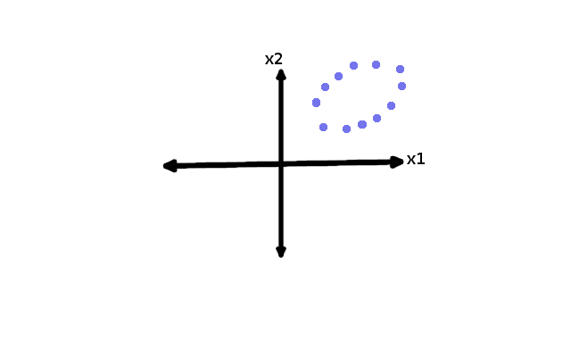

Fundamentos em Data Science
============================

## Aula 4

### Análise de Componentes Principais

### Validação Cruzada

### Árvores de Decisão


Fábio Sato
fabiosato@gmail.com

---
# PCA - Análise de Componentes Principais

PCA é uma técnica de redução de dimensionalidade

Transformação de um conjunto de dados em um espaço de alta dimensões para um espaço de menor dimensão antes de utilizar um algoritmo de aprendizado de máquina

---
# PCA - Quando Usar?

A PCA é útil antes de utilizar os dados em um algoritmo de aprendizado de máquina:

- Redução do número de graus de liberdade da hipótese, reduzindo o risco de overfitting
- A maioria dos algoritmos irão executar mais rápido. Ex: $k$-NN
- A redução da dimensionalidade pode facilitar a descrição, visualização e *insights* sobre os dados

---
# PCA - O que faz?
Encontra os componentes principais do conjunto de dados

Projeta os dados em um novo sub-espaço de menores dimensões

No novo sistema de coordenadas, o primeiro eixor corresponde ao primeiro componente principal, que é o componente que "explica" a maior variância nos dados

---
# PCA - Exemplo

Imagine uma amostra de dados com duas variáveis $x_1$ e $x_2$



---
# PCA - Primeiro componente

O primeiro componente principal explica a maior variância dos dados (direção de maior variância).


---
# PCA - Projeção

A transformação consiste em projetar os dados nesse novo subespaço ($R^2 \rightarrow R^1$)


---
# PCA - Compactação

Parte da informação original é perdida, entretanto o eixo mais importante (componente principal) é mantido, incorporando informação de $x_1$ e $x_2$


---
# PCA - Segundo componente

O segundo componente deve ser ortogonal ao primeiro componente principal

Ele deve capturar a variância não capturada no primeiro componente


---
# PCA - Número de Dimensões

Se realizarmos a PCA mantendo o número de dimensões nenhuma informação é perdida


---
# PCA - Então quantos componentes?

De forma geral, os dados tendem a seguir o princípio de Pareto (80/20).

A maior parte da variância (parte interessante dos dados) serão explicáveis por um conjunto bem pequeno de componentes principais

É possível obter 95% da variância do conjunto de dados utilizando somente 10% do número original de características

Geralmente, uma boa regra é identificar o número de componentes principais que explicam 99% da variâncias nos dados

---
# PCA - Cuidados

Ao realizar a PCA é uma boa idéia normalizar os dados primeiro

Como a PCA busca identificar os componentes principais com a maior variância, se os dados não estiverem normalizados, atributos com os maiores valores e maiores variâncias (em termos absolutos) irão dominar os primeiros componentes principais quando não deveriam.

A normalização dos dados coloca cada atributo na mesma escala de forma que cada um possa ter oportunidade de contribuir na análise de componentes principais

---
# PCA - Exercício

```python
from sklearn.datasets import fetch_mldata
from sklearn.decomposition import PCA
import matplotlib.pyplot as plt

mnist = fetch_mldata('MNIST Original')

n_components = 42

pca = PCA(n_components=n_components)

pca.fit(mnist.data)

pca.explained_variance_ratio_.cumsum()

plt.bar(n_components, pca.explained_variance_ratio_)
plt.show()

```

---
# LDA - Linear Discriminant Analysis

LDA também é um método para reduzir a dimensionalidade de dados com muitas características

Assim como a PCA é frequentemente utilizada como pré-processamento dos dados em algoritmos de aprendizado de máquina


---
# LDA

Transformação linear para encontrar uma nova dimensão que:

- Maximize a distância entre classes
- Minimize a distância intra-classe

---
# LDA

Melhor direção na qual os dados passam a ser linearmente separáveis


---
# PCA x LDA


---
# LDA - Exercício

Implemente a PCA e o LDA para o conjunto de dados *Digit* e avalie os resultados variando os valores de componentes iguais a 4, 3 e 2.


---
# Validação Cruzada

Objetivo: reduzir overfitting

Método estatístico para avaliar e comparar algoritmos de aprendizado através da divisão dos dados em dois subconjuntos

O método mais popular de validação cruzada se chama *k-fold*

Outros métodos são casos especiais do *k-fold* ou envolvem rodadas repetivivas com o *k-fold*


---
# Validação Cruzada - K-Fold

No *k-fold* os dados são particionados em $k$ segmentos iguais (ou aproximadamente iguais).

$k$ iterações de treinamento e validação são realizadas de forma que em cada iteração um segmento diferente é utilizado para validação


---
# Árvore de Decisão

- Classificação e Regressão

- Algoritmo rápido e fácil

- Modelos gerados são simples e de fácil interpretação/compreeensão

- Podem ser convertidos em regras de classificação (extração de regras/conhecimento)

---
# Árvore de Decisão

Dividir para conquistar:

- Um problema é dividido em sub-problemas mais simples e recursivamente.

- Estratégia aplicada de forma recursiva

Extração de regras "se-não"

---
# Árvore de Decisão


---
# Árvore de Decisão


---
# Árvore de Decisão

- Cada nó de decisão contem um teste de uma característica

- Cada ramo descendente corresponde a um possível valor deste atributo

- Cada folha está associada a uma classe

- Cada percurso na árvore (da raiz até a folha) corresponde a uma regra de classificação


- Cada folha corresponde a uma região (hiper-retângulo)

- A intersecção dos hiper-retângulos é o conjunto vazio

- A união dos hiper-retângulos corresponde a todo espaço de


---
# Árvore de Decisão - Fases


Uma árvore de decisão é criada em duas fases:

- Construção da Árvore: particionamento recursivo dos dados de treinamento até que todos os exemplos em cada partição pertencam a uma classe ou a partição é suficientemente pequena

- Poda da árvore: remoção de dependência no ruído estatístico ou variação que pode ser particular somente a base de treinamento

---
# Árvore de Decisão - Construção

- A forma de divisão depende do tipo de atributo
- Divisões para atributos numéricos são da forma $A \le v$, onde $v$ é um número real
- Divisões para atributos categóricos são da forma $A \in S'$, onde $S'$ é um subconjunto de todos valores possíveis de $A$ 

---
# Árvore de Decisão - Construção

Algoritmo de crescimento (árvores binárias)

```shell
PARTITION(DATA S)
  IF (ALL POINTS IN S ARE THE SAME CLASS) THEN RETURN;
  
  FOR EACH ATTRIBUTE A DO
  	EVALUATE SPLIT ON ATTRIBUTE A 
    	THAT RETURNS LARGEST INFORMATION GAIN;
  
  USE BEST SPLIT TO PARTITION S INTO S1 AND S2;
  
  PARTITION(S1);
  PARTITION(S2);

```

---
# Árvore de Decisão - *Information Gain*

Para dividir a árvore nas características mais informativas é necessário maximizar uma função objetiva

$$ IG(D_{p}, a) = I(D_{p}) - \frac{N_{left}}{N_{p}} I(D_{left}) -  \frac{N_{right}}{N_{p}} I(D_{right}) $$

Onde:
- $a$: característica
- $D_{p}$: conjunto de dados do nó pai
- $D_{j}$: conjunto de dados do $j$-ésimo nó filho
- $I$: medida de impureza
- $N_{p}$: número de amostras do nó pai
- $N_{j}$: número de amostras do $j$-ésimo nó filho

---
# Árvore de Decisão - *Impurity*

Três medidas de impureza são comumente utilizadas em árvores de decisão binárias:
- Índice GINI: $I_{G}$
- Entropia: $I_{H}$
- Erro de Classificação: $I_{E}$

---
# Árvore de Decisão - Entropia

Calcula a homogeneidade de uma amostra de dados.

Se uma amostra é completamente homogênea a entropia é zero

Se a amostra está igualmente dividida a entropia é igual a 1


---
# Árvore de Decisão - GINI

O índice GINI é um critério para minimizar o erro de classificação errada


---
# Árvore de Decisão - Entropia x GINI

Na prática tanto o GINI quanto a Entropia apresentam resultados semelhantes e não vale a pena despender muito tempo avaliando uma ou outra.

O *overfitting* de uma árvore de decisão é afetado pela profundidade este parâmetro é mais importante.

---
# Árvore de Decisão - Iris

```python
from sklearn import tree
from sklearn.metrics import confusion_matrix 

clf = tree.DecisionTreeClassifier()

clf = clf.fit(iris.data, iris.target)

y_pred = clf.predict(iris.data)

confusion_matrix(iris.target, y_pred)
```


---
# Árvore de Decisão - Exercício

- Implemente um algoritmo de classificação de dígitos do MNIST utilizando árvores de decisão

- Avalie a diferentes níveis de profundidade e verifique o impacto nos resultados sobre a base de validação

